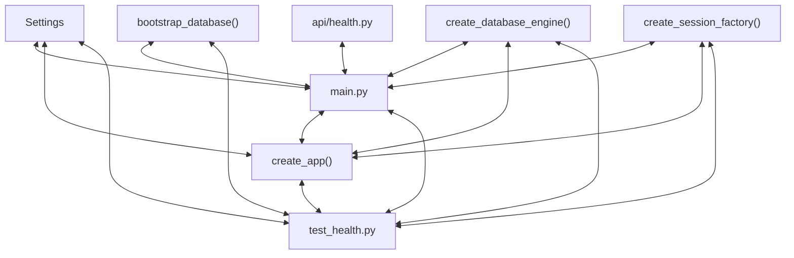

# Codebase Architectural Report

> **Auto-generated** by graphify knowledge graph analysis  
> **Purpose**: Dependency map, connection analysis, subsystem breakdown, and quality hotspots.

---

## 1. Executive Summary

- **Total Components**: `93`
- **Total Connections**: `170`
- **Subsystem Modules**: `1`
- **Dependency Types**: `11`

**Key Architectural Hubs:**

| # | Component | File | Type | Connections |
|---|-----------|------|------|-------------|
| 1 | `test_health.py` | `backend/tests/test_health.py` | file | 17 |
| 2 | `main.py` | `backend/app/main.py` | file | 14 |
| 3 | `bootstrap_database()` | `backend/app/db/bootstrap.py` | method | 10 |
| 4 | `create_app()` | `backend/app/main.py` | method | 10 |
| 5 | `create_database_engine()` | `backend/app/db/session.py` | method | 9 |
| 6 | `create_session_factory()` | `backend/app/db/session.py` | method | 9 |
| 7 | `api/health.py` | `backend/app/api/health.py` | file | 7 |
| 8 | `Settings` | `backend/app/core/config.py` | class | 7 |

---

## 2. Dependency & Connection Analysis

### Relationship Types

| Relationship | Count | Share |
|-------------|-------|-------|
| `contains` | 43 | 25% |
| `rationale_for` | 33 | 19% |
| `imports` | 29 | 17% |
| `references` | 20 | 12% |
| `calls` | 19 | 11% |
| `imports_from` | 16 | 9% |
| `inherits` | 4 | 2% |
| `conceptually_related_to` | 3 | 2% |
| `indirect_call` | 1 | 1% |
| `method` | 1 | 1% |
| `shares_data_with` | 1 | 1% |

### Hub Dependency Diagram

### Most Connected Pairs

| Component A | Component B | Shared Connections |
|-------------|-------------|-------------------|
| `Expose the WriteSpace backend package.` | `app/__init__.py` | 1 |
| `Expose backend API route modules.` | `api/__init__.py` | 1 |
| `HealthResponse` | `api/health.py` | 1 |
| `api/health.py` | `read_health()` | 1 |
| `api/health.py` | `services/health.py` | 1 |
| `api/health.py` | `check_database()` | 1 |
| `FastAPI` | `api/health.py` | 1 |
| `Expose the database-backed WriteSpace health endpoint.` | `api/health.py` | 1 |
| `api/health.py` | `main.py` | 1 |
| `BaseModel` | `HealthResponse` | 1 |

---

## 3. Subsystem & Module Breakdown

### 3.1 backend
**Nodes**: `93`  
**Files**: `.engine/workers/fb44fa7bd1cd/scratch/findings.md`, `backend/app/__init__.py`, `backend/app/api/__init__.py`, `backend/app/api/health.py`, `backend/app/core/__init__.py`, `backend/app/core/config.py` +17 more

| Component | Type | File | Connections |
|-----------|------|------|-------------|
| `test_health.py` | file | `backend/tests/test_health.py` | 17 |
| `main.py` | file | `backend/app/main.py` | 14 |
| `bootstrap_database()` | method | `backend/app/db/bootstrap.py` | 10 |
| `create_app()` | method | `backend/app/main.py` | 10 |
| `create_database_engine()` | method | `backend/app/db/session.py` | 9 |
| `create_session_factory()` | method | `backend/app/db/session.py` | 9 |
| `api/health.py` | file | `backend/app/api/health.py` | 7 |
| `Settings` | class | `backend/app/core/config.py` | 7 |
| `bootstrap.py` | file | `backend/app/db/bootstrap.py` | 7 |
| `session.py` | file | `backend/app/db/session.py` | 7 |

**External dependencies:** `Expose the WriteSpace backend package.` (1), `Expose backend API route modules.` (1), `Expose the database-backed WriteSpace health endpoint.` (1), `Describe the safe liveness response returned to clients.` (1), `Run a lightweight database query and return service health. Args: request:…` (1)

---

## 4. API Reference

Public classes and functions by subsystem.

### backend

| Name | Type | File | Connections |
|------|------|------|-------------|
| `Settings` | class | `backend/app/core/config.py` | 7 |
| `package.json` | function | `frontend/package.json` | 7 |
| `Base` | class | `backend/app/db/models.py` | 6 |
| `User` | class | `backend/app/db/models.py` | 6 |
| `dependencies` | function | `frontend/package.json` | 6 |
| `Path` | class | `` | 5 |
| `App.jsx` | class | `frontend/src/App.jsx` | 5 |
| `HealthResponse` | class | `backend/app/api/health.py` | 4 |

---

## 5. Code Quality & Architectural Risk Hotspots

### Component Type Distribution

| Type | Count | Share |
|------|-------|-------|
| function | 32 | 34% |
| class | 26 | 28% |
| method | 18 | 19% |
| file | 17 | 18% |

### High-Connectivity Hotspots

**1** component(s) with >15 connections:

| Component | File | Connections |
|-----------|------|-------------|
| `test_health.py` | `backend/tests/test_health.py` | 17 |

### Dependency Cycles

**58** circular dependency loop(s) detected:

| # | Cycle Path |
|---|-----------|
| 1 | `frontend_src_app → frontend_src_app_app → frontend_src_main` |
| 2 | `frontend_src_app → frontend_src_api_client_gethealth → frontend_src_app_app` |
| 3 | `frontend_src_api_client → frontend_src_api_client_test → frontend_src_api_client_gethealth` |
| 4 | `frontend_src_api_client_requestjson → frontend_src_api_client_test → frontend_src_api_client_gethealth` |
| 5 | `frontend_src_api_client → frontend_src_api_client_apierror → frontend_src_api_client_test` |
| 6 | `frontend_src_app → frontend_src_api_client_apierror → frontend_src_api_client_test → frontend_src_api_client_gethealth` |
| 7 | `frontend_src_api_client → frontend_src_api_client_requestjson → frontend_src_api_client_gethealth` |
| 8 | `frontend_src_app → frontend_src_api_client → frontend_src_api_client_gethealth` |
| 9 | `backend_tests_test_health → backend_tests_test_health_test_sqlite_foreign_keys_are_enabled → path → backend_tests_test_health_test_bootstrap_is_idempotent_and_seeds_hashed_admin` |
| 10 | `backend_app_db_session_create_database_engine → backend_tests_test_health_test_sqlite_foreign_keys_are_enabled → path → backend_tests_test_health_test_bootstrap_is_idempotent_and_seeds_hashed_admin` |

### Orphaned Components

**3** isolated node(s) with no connections:

| Component | File |
|-----------|------|
| `vite.config.js` | `frontend/vite.config.js` |
| `Durable FastAPI SQLAlchemy foundation` | `.engine/workers/fb44fa7bd1cd/scratch/findings.md` |
| `Editorial frontend shell` | `.engine/workers/fb44fa7bd1cd/scratch/findings.md` |

---

## 6. How to Navigate

1. **Interactive D3 Map** — open `graph.html` to explore node connections visually.
2. **Knowledge Graph Queries** — use MCP tools (`graph_query`, `graph_explain_node`, `graph_impact_radius`).
